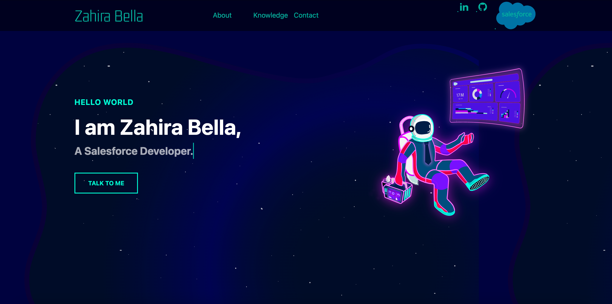
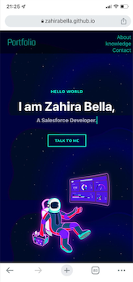

# Portfolio 🌟

This is my personal portfolio website built using HTML, CSS, and JavaScript. The
website showcases my skills and experience as a front-end developer, including
my projects, education, and work experience. The objective of this website is to
provide potential employers and collaborators with an overview of my skills and
interests, as well as a sense of my design style and coding ability.

Feel free to explore the website to learn more about my background, experience,
and projects. You can also get in touch with me using the contact form on the
website. Thank you for visiting my portfolio!

## Table of Contents 📚

- [Portfolio 🌟](#portfolio-)
  - [Table of Contents 📚](#table-of-contents-)
  - [General Info 💻](#general-info-)
  - [Screenshots 📷](#screenshots-)
    - [Desktop](#desktop)
    - [Mobile](#mobile)
  - [Technologies 💻](#technologies-)
  - [Setup 🛠️](#setup-️)
  - [Status 🚀](#status-)
  - [Contact 📱](#contact-)

## General Info 💻

> A website platform designed to give an introduction about me development using
> agile methodology, HTML,CSS and js 🌐

## Screenshots 📷

### Desktop

### Mobile

## Technologies 💻

- HTML5
- CSS3
- VSC Code
- NPM

## Setup 🛠️

- Clone the repo
- Run `npm install`

## Status 🚀

Project is: _done_ ✅

## Contact 📱

[Zahira](https://github.com/ZahiraBella) 🤝
