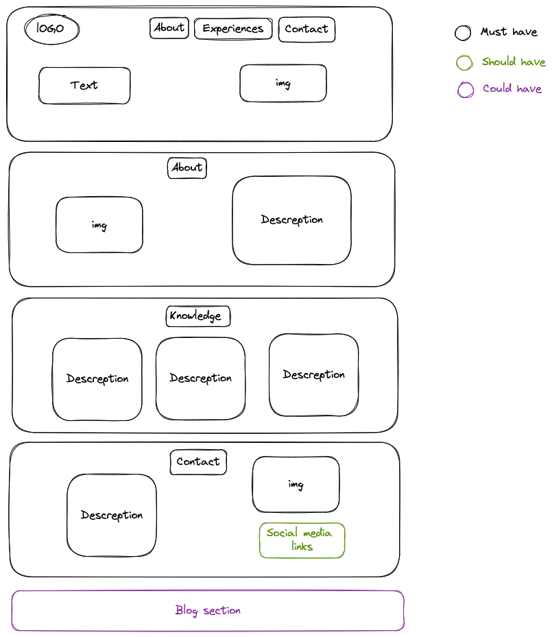

# Hack Your Future rebuild

---

## User Story Dependencies

[Story Dependency Diagram](user-personas.md)

---

## WIREFRAME

## Setup

- create a new repo
- add collaborators
- turn on GitHub pages and give them `write` access
- protect `main` branch
- turn on discussion

---

## Home page

> these are necessary for basic usability

---

### Logo

- As a user I want to see the logo in the left-top of the page

### html

- add `header` tag

### css

- add class `navbar`, `container flex`

### Navigation bar

- As a user I can navigate through three elements : About,knowledge and contact
  there's a navigation bar on the right of the logo

#### html

- add `ul`, `li`, `a`

#### css

- add class `navbar`, `container flex`

### Title

- As a user I can find the title

#### html

- add `h1`

### description

- As a user I can easily find short description about the person

#### html

- add `p`

### about

- As a user I want to have find an idea about the person

#### html

- add `img`

### Knowledge

- As a user I want to see the owner knowledge . ​

#### Get started info : html

- add `section`
- add `div`
- add `h1`
- add `p` ​

### contact

​- As a user I want to see information to contact the owner .
